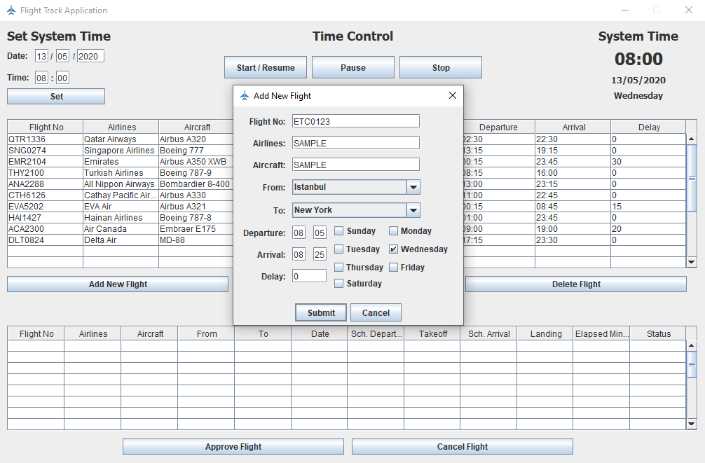

# Flight Track Application
 This program simulates the flights between the major capitals, such as New York, Sydney, Paris, Tokyo, Istanbul etc. around the world.

### System
 The system includes 10 routes between 5 major capitals from different continents as default. The user could also add new capitals as well as new destinations to the system. In addition to that, the user could delete and update existing destinations via the GUI. Besides, the user could declare the flight details, such as the weekdays, the departure and arrival times, the aircraft model, the flight number and the name of the airlines.

 The system has a system date, and one second in the system represents one minute in the real life. User is able to start, pause, resume and stop the time of your system. The scheduled flights is going to be simulated regarding to the system time.

 The system has a control tower to manage take offs and landings. For example, the tower manager could set some delay for a scheduled flight or she/he could cancel certain flights or even make the aircrafts, which are close to the related tower, wait in the air.

### Details
 The program is written considering the event-driven programming techniques. The user would use the GUI for running the defined modules. There is only one user, who would be in charge of all system activities. The main activities are given as follows:
  * Add/Delete/Update capitals
  * Add/Delete/Update flight information
  * Set some delay for a specific flight or cancel a certain flight in a given airport
  * Make the flights, which are close enough to a given airport, wait and then give them permission for landing
  * Report the information (scheduled arrival/departure time, take off and landing time, delay, date, flight number, the name of the airlines, the departure and the arrival city), for each taking off and landing into the file (flight_report.txt).
  * Start, pause, resume and stop the system time.

### Screenshots

-------------------------------------------------

----------------------------------------------------------------------------------------------------------------

----------------------------------------------------------------------------------------------------------------

----------------------------------------------------------------------------------------------------------------

----------------------------------------------------------------------------------------------------------------

----------------------------------------------------------------------------------------------------------------

----------------------------------------------------------------------------------------------------------------

